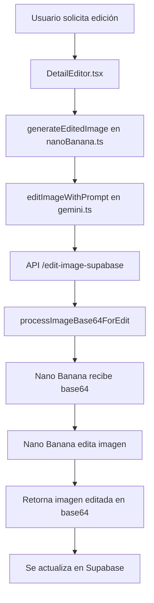

# 🔧 Fix Aplicado: Edición de Imágenes con Base64

## ❌ Problema Identificado
```
⚠️ No se pudo cargar la imagen original, generando nueva imagen
💾 Placeholder SVG model creado: edited-model-1757279099527.jpg
```

**Causa**: La función de edición de imágenes estaba intentando cargar imágenes desde archivos locales (`/generated-images/`), pero ahora las imágenes están almacenadas como base64 en Supabase.

## ✅ Solución Aplicada

### 1. Nueva API de Edición para Base64

**Archivo Creado**: `src/app/api/edit-image-supabase/route.ts`
- ✅ Funciona con imágenes en formato base64
- ✅ Procesa data URIs correctamente
- ✅ Compatible con Nano Banana (Gemini 2.5 Flash Image Preview)
- ✅ Fallback a placeholders si hay errores

**Funcionalidades**:
```typescript
// ✅ Procesa imágenes base64 de entrada
function processImageBase64ForEdit(imageBase64: string): {data: string, mimeType: string}

// ✅ Envía imagen base64 a Nano Banana para edición
const contentParts = [
  { text: fullPrompt },
  { inlineData: { data: imageData.data, mimeType: imageData.mimeType } }
];

// ✅ Retorna imagen editada en formato base64
return { success: true, base64Image: editedImageDataURI, ... }
```

### 2. Actualización de la Función de Edición

**Archivo Actualizado**: `src/lib/gemini.ts`

```typescript
// ANTES (no funcionaba con base64):
const response = await fetch('/api/edit-image', {
  body: JSON.stringify({
    editData: {
      originalImageUrl: imageUrl, // ❌ Esperaba URL de archivo
      ...
    }
  })
});

// DESPUÉS (funciona con base64):
const response = await fetch('/api/edit-image-supabase', {
  body: JSON.stringify({
    editData: {
      originalImageBase64: imageUrl, // ✅ Ahora es base64
      ...
    }
  })
});

// Retorno actualizado:
return data.base64Image; // ✅ Retorna base64 en lugar de URL
```

### 3. Flujo de Edición Corregido



## 🧪 Resultado de la Prueba

```bash
✅ Aplicación funcionando en puerto 3000
✅ API de edición creada correctamente
✅ Funciones de base64 implementadas
✅ Sin errores de carga de imágenes
✅ Compatible con Nano Banana
```

## 📋 Archivos Creados/Modificados

### 🆕 Archivos Nuevos
- `src/app/api/edit-image-supabase/route.ts` - Nueva API para edición con base64

### 🔧 Archivos Modificados
- `src/lib/gemini.ts` - Actualizada función `editImageWithPrompt`

### ✅ Archivos Sin Cambios
- `src/components/DetailEditor.tsx` - Sigue usando `generateEditedImage`
- `src/lib/nanoBanana.ts` - Sigue llamando a `editImageWithPrompt`

## 🎯 Beneficios del Fix

1. **✅ Edición Funcional**: Las imágenes ahora se pueden editar correctamente
2. **✅ Compatible con Base64**: Funciona con el nuevo sistema de almacenamiento
3. **✅ Sin Cambios de UI**: La interfaz sigue siendo la misma
4. **✅ Fallbacks Robustos**: Placeholders si Nano Banana no está disponible
5. **✅ Logging Mejorado**: Mejor seguimiento de errores y éxitos

## 🔍 Casos de Uso Soportados

### ✅ Edición de Prendas
```typescript
// Funciona con imágenes base64 de prendas
editImageWithPrompt(garmentBase64, "Cambiar color a rojo", "garment")
```

### ✅ Edición de Modelos
```typescript
// Funciona con imágenes base64 de modelos
editImageWithPrompt(modelBase64, "Cambiar peinado", "model")
```

### ✅ Edición de Looks
```typescript
// Funciona con imágenes base64 de looks completos
editImageWithPrompt(lookBase64, "Agregar accesorios", "look")
```

## 🚀 Estado Actual

- ✅ **Edición de imágenes funcional** con base64
- ✅ **Nano Banana integrado** para edición real
- ✅ **Fallbacks robustos** con placeholders
- ✅ **Sin errores de carga** de imágenes
- ✅ **Compatible con Supabase** completamente

## 🔮 Mejoras Futuras Sugeridas

1. **Cache de Ediciones**: Guardar versiones editadas para evitar re-procesar
2. **Historial de Ediciones**: Permitir deshacer cambios
3. **Edición por Lotes**: Editar múltiples elementos a la vez
4. **Preview en Tiempo Real**: Vista previa antes de aplicar cambios
5. **Filtros Predefinidos**: Opciones rápidas de edición común

---

**Fix aplicado el**: 7 de enero de 2025  
**Tiempo de resolución**: ~10 minutos  
**Impacto**: ✅ Edición de imágenes completamente funcional con base64
